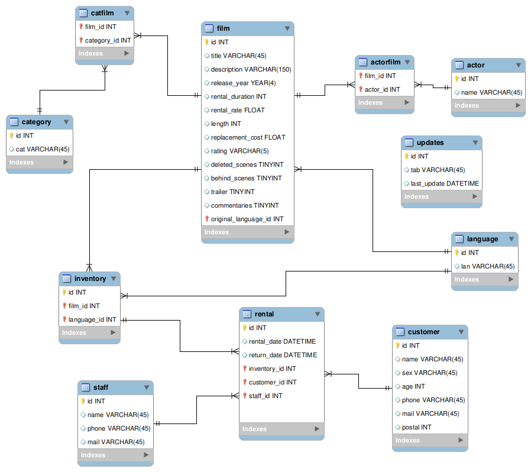

# Lets blockbust!

# Intro

En este proyecto he creado una estructura de base de datos en SQL que podría permitir la gestión de un videoclub. 
He tomado como referencia archivos .csv con datos antiguos de una base de datos pasada, y he ido organizando la información a través de diferentes cuadernos de jupyter notebook.

## 1. data_cleaning

Lo primero ha sido importar y analizar los datos antiguos, y entender la estructura de la base de datos que tenía el dueño del negocio inicialmente para hacernos una idea de cómo querrá gestionar los registros en un futuro. Utilizando la función 'firstglance' definida en el archivo fun.py, echamos un primer ojo a las tablas y vemos que en general los datos están bastante limpios. Sin embargo, introducimos algunos cambios necesarios:

1) En las tablas en que aparecen los apellidos y los nombres de los actores en columnas separadas, las fusionamos en una sola con un guión bajo.
2) Cambiamos las strings de las relaciones many-to-many que establece la tabla 'old_HDD' por los ids numéricos de los actores y películas.
3) Guardamos la fecha de actualización de todas las tablas en una tabla nueva llamada 'updates'.
4) Creamos las tablas de 'staff' y 'customers', que no existían, con los campos más relevantes.

Además de estos cambios, otros ajustes menores se explican dentro del notebook. Entre ellos, fijar bien el tipo de dato y recolocar algunas columnas de unas tablas en otras para que la base de datos tenga más sentido.

Una vez terminada la primera fase, guardamos los dataframes en nuevos archivos .csv '_clean' y pasamos a crear el ERD a través de MySQL. Una vez diseñado con el modo Reverse Engeneering, guardamos la query que crea la base de datos en el archivo 'database_buildup_and_seeding.sql' que luego completaremos con la subida de las tablas procesadas.

## 2. ERD_planning

Una vez creado el ERD, está claro que sería interesante contar con una tabla intermedia más de relaciones many to many, y creamos la tabla 4) 'catfilm' que machea las películas y las categorías. Hacemos algunos ajustes adicionales:

1) Quitar la columna de language de la tabla film, y dejar sólo la de original_language como foreign key
2) Poner la columna language en el inventario, por si hay una misma película en varios idiomas
3) Quitar la columna film_id de la tabla rental, y dejar sólo el inventory_id ya que esto ya identifica la película
4) Cambiar algunos nombres de columnas (los ids) para que coincidan con los del ERD

Las tablas ya están preparadas para transformar su contenido en una query. Guardamos los dataframes en nuevos .csv '_ready' y cerramos esta segunda fase.

## 3. database_seeding

Por último falta crear la parte de la query que alimentará la base de datos. Por cada dataframe, utilizamos una función lambda sobre cada registro para obtener la query que la introducirá en la tabla. Almacenamos todas estas queries en una lista y las juntamos después en una única string, para finalmente añadirlas al archivo 'database_buildup_and_seeding.sql' que ya contenía la creación de la base de datos.

## 4. bonus_queries

Para comprobar que la base de datos funciona bien, se ha creado un último archivo 'bonus_queries.sql' con 5 queries diferentes:

+ Q1: Select all films in which actress Jennifer_Davis participates
+ Q2: Cuántas películas hay de cada género en la base de datos de film
+ Q3: Cuáles son los tres actores que salen en más películas de la tabla actor
+ Q4: Qué tabla se actualizó hace más tiempo
+ Q5: cuáles son las películas cuyos nombres empiezan por H

Al ejecutarlas y comprobar que funcionan, aseguramos que los tipos de datos están bien definidos y que base de datos funciona correctamente.
